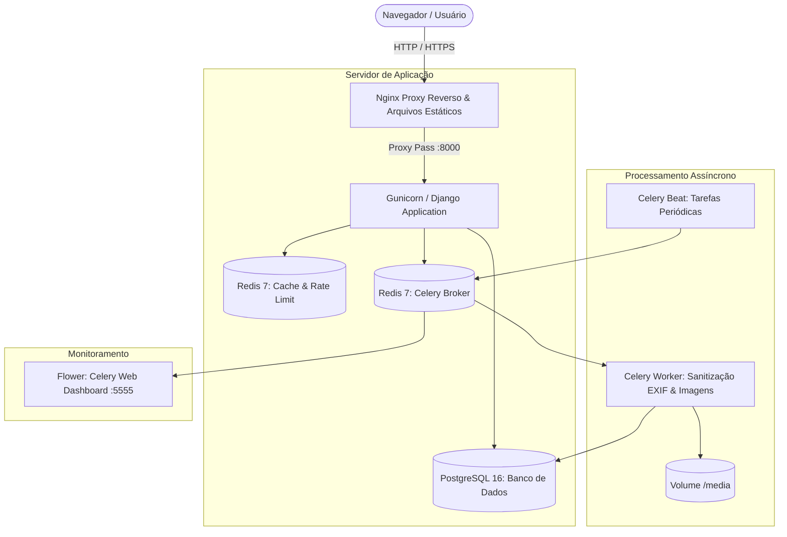

# 📋 Forms Denúncia

> **Sistema de Registro, Gestão e Acompanhamento de Denúncias de Negligência à Saúde e Segurança do Trabalhador**

[](https://www.python.org/)
[](https://www.djangoproject.com/)
[](https://www.postgresql.org/)
[](https://redis.io/)
[](https://docs.celeryq.dev/)
[](https://www.docker.com/)
[-0A9EDC?logo=pytest&logoColor=white)](https://docs.pytest.org/)
[](https://github.com/features/actions)

---

## 📖 Índice

1. [Sobre o Projeto](#-sobre-o-projeto)
2. [Como o Sistema Funciona](#-como-o-sistema-funciona)
3. [Arquitetura e Fluxo de Dados](#-arquitetura-e-fluxo-de-dados)
4. [Stack Tecnológica](#-stack-tecnológica)
5. [Pré-requisitos](#-pré-requisitos)
6. [Como Executar o Projeto](#-como-executar-o-projeto)
   - [Opção 1: Executando com Docker Compose (Recomendado)](#opção-1-executando-com-docker-compose-recomendado)
   - [Opção 2: Executando Localmente com Virtualenv](#opção-2-executando-localmente-com-virtualenv)
   - [Opção 3: Executando em Ambiente de Produção](#opção-3-executando-em-ambiente-de-produção)
7. [Rotas e Funcionalidades Principais](#-rotas-e-funcionalidades-principais)
8. [Testes Automatizados e Auditoria de Segurança](#-testes-automatizados-e-auditoria-de-segurança)
9. [Pipeline de CI/CD (GitHub Actions)](#-pipeline-de-cicd-github-actions)
10. [Estrutura do Repositório](#-estrutura-do-repositório)

---

## 🎯 Sobre o Projeto

O **Forms Denúncia** é uma plataforma desenvolvida para facilitar a comunicação e triagem de ocorrências de negligência às normas de saúde e segurança do trabalho (como instalações inadequadas, falta de EPI, assédio, riscos biológicos ou estruturais).

O sistema oferece uma interface pública intuitiva e segura para envio de denúncias pela população/trabalhadores (com opção de anonimato e upload de evidências fotográficas), além de um painel de controle administrativo completo para auditores e órgãos de fiscalização (ex: CEREST) analisarem, responderem e acompanharem o status de cada protocolo.

---

## ⚙️ Como o Sistema Funciona

O ciclo de vida da aplicação divide-se em três fluxos principais:

### 1. Fluxo do Denunciante (Cidadão / Trabalhador)
1. O usuário acessa a página inicial (`/`) e preenche o formulário com:
   - Identificação da empresa (nome, endereço, estado e cidade com busca dinâmica).
   - Tipo de irregularidade e descrição detalhada dos fatos.
   - Data do ocorrido e indicação de testemunhas.
   - Opção de denúncia **anônima** ou **identificada** (com e-mail para contato).
   - Anexo de uma ou múltiplas fotos/evidências.
2. Ao enviar, o sistema gera automaticamente um **Código de Protocolo Único**.
3. O denunciante pode consultar a situação da sua denúncia a qualquer momento na aba **Pesquisar** (`/pesquisar/`) informando o número do protocolo.

### 2. Fluxo do Gestor / Auditor (CEREST / Administração)
1. Auditores autenticam-se com login e senha na área restrita (`/dashboard/login/`).
2. No **Dashboard** (`/dashboard/`), os gestores visualizam indicadores consolidados, gráficos de denúncias por município/tipo e lista detalhada de casos pendentes.
3. Ao acessar uma denúncia (`/protocolo/<protocolo>/`), o gestor analisa o relato, visualiza as fotos sanitizadas e registra a resposta oficial com alteração do status.

### 3. Processamento em Background (Privacidade, Compressão e Desempenho)
- **Sanitização de Metadados EXIF e Compressão Automática:** Ao receber imagens anexadas, uma tarefa assíncrona do **Celery** utiliza a biblioteca **Pillow** para:
  1. Remover 100% dos dados sensíveis embutidos nas fotos (coordenadas de GPS do denunciante e modelo do aparelho), protegendo a identidade e privacidade de quem denunciou.
  2. Redimensionar proporcionalmente fotos em altíssima resolução (acima de 1920px) com interpolação `LANCZOS`.
  3. Aplicar compressão inteligente (`quality=82`, `optimize=True`), gerando uma **economia de 70% a 90% no armazenamento em disco** sem perda visual para leitura de documentos e provas.

---

## 🏗️ Arquitetura e Fluxo de Dados



---

## 💻 Stack Tecnológica

| Camada / Componente | Tecnologia | Motivo e Justificativa da Escolha |
| :--- | :--- | :--- |
| **Linguagem** | **Python 3.10 / 3.11** | Tipagem estática moderna, ecossistema maduro para web e processamento de dados. |
| **Framework Web** | **Django 5.2** | Estrutura robusta com ORM seguro, sistema de autenticação nativo, CSRF protection e painel administrativo out-of-the-box. |
| **Servidor WSGI** | **Gunicorn 22.0** | Servidor WSGI de produção padrão para Python, eficiente em concorrência com modelo multi-processos (*pre-fork*). |
| **Banco de Dados** | **PostgreSQL 16** | Confiabilidade ACID, extensões de busca textual (`pg_trgm`) para filtros de cidades e denúncias com alta performance. |
| **Cache & Sessões** | **Redis 7 (django-redis)** | Cache em memória ultrarrápido para controle de sessões e rate limiting com política LRU de expiração. |
| **Fila Assíncrona** | **Celery 5.6 & Celery Beat** | Execução de tarefas desacopladas (limpeza EXIF de fotos) sem bloquear o tempo de resposta HTTP do usuário. |
| **Monitoramento Celery** | **Flower 2.0** | Interface web em tempo real para inspeção de filas, tarefas executadas, tempo de processamento e falhas. |
| **Processamento de Imagem** | **Pillow 12.2** | Manipulação de imagens e extração/remoção segura de metadados EXIF. |
| **Autocomplete UI** | **django-autocomplete-light** | Seleção dinâmica com AJAX de estados e mais de 5.500 municípios normalizados sem sobrecarregar o DOM. |
| **Segurança & Rate Limit** | **django-ratelimit & Bandit** | Proteção contra ataques de força bruta, spam de denúncias e análise estática contra vulnerabilidades de código. |
| **Auditoria de Segredos** | **detect-secrets** | Varredura contínua no CI para impedir que senhas, tokens ou credenciais hardcoded sejam versionadas. |
| **Framework de Testes** | **Pytest & Factory Boy** | Testes automatizados expressivos, fixtures desacopladas e geração automatizada de dados realistas (Faker). |
| **Conteinerização** | **Docker & Docker Compose** | Imagens multi-stage leves, reprodutibilidade exata entre ambientes de desenvolvimento e produção. |
| **CI/CD** | **GitHub Actions** | Automação completa de testes, auditoria de segurança, build no GHCR e deploy remoto via SSH. |

---

## 📦 Pré-requisitos

Certifique-se de ter instalado em sua máquina:
- **Git:** Para clonar o repositório.
- **Docker** (versão 24.0+) e **Docker Compose** (versão v2.20+) *(Recomendado)*
- *Ou para execução local sem Docker:* **Python 3.10+**, **PostgreSQL 15+** e **Redis 7+**.

---

## 🚀 Como Executar o Projeto

### Opção 1: Executando com Docker Compose (Recomendado)

Esta é a forma mais rápida e isolada de executar todos os serviços da aplicação (Django, PostgreSQL, Redis, Celery Worker, Celery Beat e Flower).

1. **Clone o repositório:**
   ```bash
   git clone https://github.com/allissonchervenski/forms_denuncia.git
   cd forms_denuncia
   ```

2. **Configure o arquivo de ambiente (.env):**
   ```bash
   cp .env.example .env
   ```

3. **Construa as imagens e inicie os containers:**
   ```bash
   docker compose up --build -d
   ```

4. **Aplique as migrações do banco de dados:**
   ```bash
   docker compose exec web python manage.py migrate
   ```

5. **Popule a base com as cidades e estados brasileiros (se necessário):**
   ```bash
   docker compose exec web python manage.py loaddata data/init.sql
   ```

6. **Crie um usuário administrador para o Dashboard:**
   ```bash
   docker compose exec web python manage.py createsuperuser
   ```

7. **Acesse os serviços:**
   - 🌐 **Aplicação Web:** [http://localhost:8000](http://localhost:8000)
   - 📊 **Painel Dashboard:** [http://localhost:8000/dashboard/login/](http://localhost:8000/dashboard/login/)
   - ⚙️ **Django Admin:** [http://localhost:8000/admin/](http://localhost:8000/admin/)
   - 🌸 **Monitor do Celery (Flower):** [http://localhost:5555](http://localhost:5555)

---

### Opção 2: Executando Localmente com Virtualenv

Caso queira executar diretamente no seu ambiente Python local:

1. **Crie e ative um ambiente virtual:**
   ```bash
   python3 -m venv .venv
   source .venv/bin/activate  # No Linux/macOS
   # ou: .venv\Scripts\activate no Windows
   ```

2. **Instale as dependências (incluindo pacotes de desenvolvimento e testes):**
   ```bash
   pip install --upgrade pip
   pip install -e ".[dev]"
   ```

3. **Inicie os serviços do PostgreSQL e Redis** em sua máquina e garanta que as credenciais coincidam com o seu `.env`.

4. **Execute as migrações e inicie o servidor de desenvolvimento:**
   ```bash
   python manage.py migrate
   python manage.py runserver 0.0.0.0:8000
   ```

5. **Em outros dois terminais, execute o Celery Worker e o Celery Beat:**
   ```bash
   # Terminal 2 - Celery Worker:
   celery -A forms_denuncia worker -l INFO
   
   # Terminal 3 - Celery Beat:
   celery -A forms_denuncia beat -l INFO
   ```

---

### Opção 3: Executando em Ambiente de Produção

Para implantação em servidores de produção com **Nginx** como proxy reverso, Gunicorn otimizado e imagem imutável:

1. **Copie o modelo de produção e configure as credenciais seguras:**
   ```bash
   cp .env.production.example .env
   # Edite o .env com SECRET_KEY de 50+ chars, DEBUG=False, ALLOWED_HOSTS e senhas fortes
   ```

2. **Execute o script automatizado de deploy:**
   ```bash
   ./scripts/deploy.sh
   ```
   *Ou execute manualmente via Docker Compose de Produção:*
   ```bash
   docker compose -f docker-compose.prod.yml up -d --build
   docker compose -f docker-compose.prod.yml run --rm web python manage.py migrate --noinput
   docker compose -f docker-compose.prod.yml run --rm web python manage.py collectstatic --noinput
   ```

> 💡 **Hospedagem Gratuita Permanente:** Para o passo a passo completo de como hospedar este projeto a **custo zero** com alta performance (até 4 vCPUs e 24GB de RAM) e SSL gratuito, consulte o **[Guia de Deploy Gratuito na Oracle Cloud Always Free](docs/deploy_gratuito_guia.md)**.

---

## 📍 Rotas e Funcionalidades Principais

| Rota / URL | Acesso | Descrição |
| :--- | :--- | :--- |
| `/` | Público | Página inicial com o formulário de cadastro de nova denúncia. |
| `/pesquisar/` | Público | Campo de busca rápida por número de protocolo com rate limiting. |
| `/protocolo/<str:protocolo>/` | Público / Restrito | Exibição da situação do protocolo. Permite resposta caso o usuário seja gestor logado. |
| `/dashboard/` | Autenticado | Painel de controle de denúncias com estatísticas, gráficos e métricas. |
| `/dashboard/login/` | Público | Autenticação para gestores e auditores. |
| `/dashboard/logout/` | Autenticado | Encerramento de sessão segura. |
| `/admin/` | Superusuário | Gerenciamento administrativo central do Django. |
| `/cidade-autocomplete/` | Público | Endpoint AJAX para busca e autocompletar de cidades brasileiras. |

---

## 🧪 Testes Automatizados e Auditoria de Segurança

O projeto possui **73 testes automatizados** cobrindo cenários unitários, de integração, carga adversária/caos e regras de negócio com **82% de cobertura de código**.

### Executando os Testes com Pytest
```bash
# Executa todos os testes:
pytest

# Executa testes com relatório detalhado de cobertura:
pytest --cov=core --cov=dashboard --cov-report=term-missing

# Executa testes gerando relatório em HTML:
pytest --cov=core --cov=dashboard --cov-report=html
# Abra htmlcov/index.html no navegador para visualizar linha por linha
```

### Validação de Diretivas de Produção do Django
```bash
python manage.py check --deploy --settings=forms_denuncia.settings.production
```

### Auditoria de Segurança e Secrets Leakage
```bash
# Varredura de chaves hardcoded e segredos:
detect-secrets scan --exclude-files '(\.venv/|media/|staticq/|docs/|\.git/)'

# Análise estática de vulnerabilidades Python com Bandit:
bandit -r core dashboard forms_denuncia -ll -ii -x "*tests*,*test_settings*"
```

---

## 🔄 Pipeline de CI/CD (GitHub Actions)

O repositório possui fluxos de trabalho configurados em `.github/workflows/`:

1. **[Django CI & Security Audit (.github/workflows/ci.yml)](.github/workflows/ci.yml):**
   - **Job 1 (Security Audit):** Executa `detect-secrets`, auditoria de arquivos proibidos/vazados no Git e `bandit`.
   - **Job 2 (Test Matrix):** Sobe serviços reais de PostgreSQL 16 e Redis 7, testa em matriz Python 3.10 e 3.11, roda o `check --deploy` e executa os 73 testes com `pytest` gerando relatório de cobertura XML.
2. **[Build Container & Deploy (.github/workflows/deploy.yml)](.github/workflows/deploy.yml):**
   - Disparado em push na `main`/`master` ou criação de tags `v*.*.*`.
   - Realiza build multi-stage otimizado da imagem Docker com cache GHA.
   - Publica a imagem no **GitHub Container Registry (`ghcr.io`)**.
   - Conecta via SSH no servidor de produção e executa o deploy automatizado com zero downtime.

---

## 📂 Estrutura do Repositório

```text
forms_denuncia/
├── .github/
│   └── workflows/              # Pipelines de CI e Deploy do GitHub Actions
│       ├── ci.yml              # Pipeline de testes, cobertura e auditoria
│       └── deploy.yml          # Pipeline de build Docker e deploy contínuo
├── core/                       # App principal (Modelos de Denúncia, Cidades, Tasks)
│   ├── forms.py                # Formulários de denúncia com validação
│   ├── models.py               # Entidades Denuncia, Cidades, Estados, Evidencia
│   ├── tasks.py                # Tasks Celery (Sanitização EXIF de fotos)
│   ├── views.py                # Views públicas (Envio, Pesquisa, Protocolo)
│   └── templates/core/         # Templates HTML (Tailwind CSS e componentes)
├── dashboard/                  # App de gestão e auditoria do CEREST
│   ├── forms.py                # Formulários administrativos e login
│   ├── views.py                # Views do dashboard e métricas
│   └── templates/dashboard/    # Templates do painel administrativo
├── data/                       # Cargas de dados iniciais (Cidades normalizadas, SQL)
├── docs/                       # Documentação técnica e planos de arquitetura
├── forms_denuncia/             # Configurações do Projeto Django
│   ├── celery.py               # Inicialização e configuração do Celery
│   ├── settings/               # Configurações modulares (base, local, production)
│   ├── urls.py                 # Roteamento global da aplicação
│   └── wsgi.py                 # Ponto de entrada WSGI para Gunicorn
├── nginx/                      # Configurações de Proxy Reverso e SSL do Nginx
│   ├── Dockerfile              # Imagem Alpine do Nginx
│   └── nginx.conf              # Regras de gzip, cache, headers e proxy_pass
├── scripts/                    # Scripts operacionais
│   └── deploy.sh               # Automação de deploy no servidor de produção
├── tests/                      # Suíte de testes automatizados (Pytest)
│   ├── core/                   # Testes unitários do core (Forms, Models, Tasks)
│   ├── dashboard/              # Testes do dashboard
│   ├── test_chaos.py           # Testes de resiliência e falhas adversárias
│   └── test_security.py        # Testes de rate limiting e segurança
├── .dockerignore               # Bloqueio de arquivos sensíveis na imagem Docker
├── .env.example                # Exemplo de variáveis de ambiente para desenvolvimento
├── .env.production.example     # Exemplo de variáveis de ambiente para produção
├── .gitignore                  # Arquivos ignorados pelo controle de versão
├── Dockerfile                  # Multi-stage Dockerfile para produção
├── docker-compose.yml          # Orquestração para desenvolvimento local
├── docker-compose.prod.yml     # Orquestração para ambiente de produção
├── pyproject.toml              # Especificação de dependências e metadados
└── README.md                   # Documentação principal do projeto
```

---

## 📄 Licença

Este projeto é desenvolvido para fins de interesse público e fiscalização da saúde e segurança do trabalho. Consulte a documentação e administradores do projeto para mais informações sobre termos de uso.
