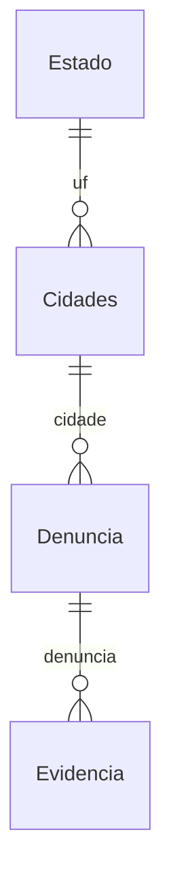

# Model Denuncia (core/models.py)

## 📍 Arquivo: `core/models.py`

## 🎯 O que é
Model principal que representa uma **denúncia** no sistema. Contém todos os campos do formulário, status, protocolo único (UUID) e relacionamentos.

---

## 💻 Código Completo

```python
from django.db import models
import uuid

class Estado(models.Model):
    uf = models.CharField(max_length=2, unique=True)

    def __str__(self):
        return self.uf

class Cidades(models.Model):
    nome = models.CharField(max_length=50)
    estado = models.ForeignKey(Estado, on_delete=models.CASCADE)

    def __str__(self):
        return self.nome

class Denuncia(models.Model):
    DENUNCIAS_CHOICES = [
        ("ASSEDIO", "ASSÉDIO (MORAL, SEXUAL, ETC.)"),
        ("DISCRIMINACAO", "DISCRIMINAÇÃO (RAÇA, GÊNERO, IDADE, ETC.)"),
        ("VIOLACAO", "VIOLAÇÕES DE POLÍTICAS DA EMPRESA"),
        ("SEGURANCA", "QUESTÕES DE SEGURANÇA NO TRABALHO"),
        ("OUTROS", "OUTRAS QUESTÕES ESPECÍFICAS"),
    ]

    nome_empresa = models.CharField(max_length=255)
    endereco_empresa = models.CharField(max_length=255)
    cidade = models.ForeignKey(
        Cidades,
        related_name='Denuncia',
        blank=False,
        null=False,
        on_delete=models.CASCADE
    )
    tipo_denuncia = models.CharField(
        max_length=13,
        choices=DENUNCIAS_CHOICES
    )
    descricao = models.TextField(blank=False, null=False)
    testemunhas = models.CharField(max_length=255, blank=True, null=True)
    acoes = models.CharField(max_length=255, blank=True, null=True)
    anonimo = models.BooleanField(default=True)
    email = models.EmailField(
        max_length=100,
        blank=True,
        null=True,
        unique=False,
    )
    data_ocorrido = models.DateField(blank=True, null=True)

    created_at = models.DateTimeField(auto_now_add=True)
    protocolo = models.UUIDField(editable=False, default=uuid.uuid4, unique=True)
    situacao = models.BooleanField(default=True)

    resposta = models.TextField(blank=True, null=True)

    def __str__(self):
        return self.nome_empresa
```

---

## 🔍 Campo por Campo

### `Estado` e `Cidades` - Normalização Geográfica
```python
class Estado(models.Model):
    uf = models.CharField(max_length=2, unique=True)  # 'SP', 'RJ', 'MG'

class Cidades(models.Model):
    nome = models.CharField(max_length=50)
    estado = models.ForeignKey(Estado, on_delete=models.CASCADE)
```
- **Normalização:** Evita duplicação "São Paulo", "Sao Paulo", "SP".
- **FK `on_delete=CASCADE`:** Se apaga Estado, apaga Cidades (consistência).
- **Populado via:** `core/csv_reader.py` lendo `Municipios_normalizados.csv`.

---

### Campos de Identificação
```python
nome_empresa = models.CharField(max_length=255)
endereco_empresa = models.CharField(max_length=255)
cidade = models.ForeignKey(Cidades, ..., on_delete=models.CASCADE)
```
- **Obrigatórios** (`blank=False, null=False` default).
- **Cidade** = FK para tabela normalizada (não CharField livre).

### Tipo de Denúncia
```python
DENUNCIAS_CHOICES = [
    ("ASSEDIO", "ASSÉDIO (MORAL, SEXUAL, ETC.)"),
    ("DISCRIMINACAO", "DISCRIMINAÇÃO (RAÇA, GÊNERO, IDADE, ETC.)"),
    ("VIOLACAO", "VIOLAÇÕES DE POLÍTICAS DA EMPRESA"),
    ("SEGURANCA", "QUESTÕES DE SEGURANÇA NO TRABALHO"),
    ("OUTROS", "OUTRAS QUESTÕES ESPECÍFICAS"),
]
tipo_denuncia = models.CharField(max_length=13, choices=DENUNCIAS_CHOICES)
```
- **`max_length=13`** = maior chave `"DISCRIMINACAO"` (13 chars).
- **Choices** = validação no formulário + admin + API.

### Descrição e Detalhes
```python
descricao = models.TextField(blank=False, null=False)
testemunhas = models.CharField(max_length=255, blank=True, null=True)
acoes = models.CharField(max_length=255, blank=True, null=True)
```
- `TextField` = sem limite prático (descrição longa).
- `testemunhas`, `acoes` = opcionais.

### Anonimato e Contato
```python
anonimo = models.BooleanField(default=True)
email = models.EmailField(max_length=100, blank=True, null=True, unique=False)
```
- **Default `True`** = proteção padrão do denunciante.
- `email` **opcional** mas se `anonimo=False` → view exige (JS no template).
- `unique=False` = mesmo email pode denunciar múltiplas empresas.

### Data e Timestamps
```python
data_ocorrido = models.DateField(blank=True, null=True)
created_at = models.DateTimeField(auto_now_add=True)
```
- `data_ocorrido` = quando aconteceu (passado, opcional).
- `created_at` = **auto** no INSERT (imutável).

### Protocolo (UUID)
```python
protocolo = models.UUIDField(editable=False, default=uuid.uuid4, unique=True)
```
| Atributo | Função |
|----------|--------|
| `editable=False` | Não aparece no admin/form |
| `default=uuid.uuid4` | Gera UUIDv4 aleatório no INSERT |
| `unique=True` | Índice único no banco (PK alternativa) |

**Formato:** `550e8400-e29b-41d4-a716-446655440000` (36 chars).
**Uso:** URL `/protocolo/<uuid:protocolo>/` - **não sequencial**, não adivinhável.

### Situação e Resposta
```python
situacao = models.BooleanField(default=True)
resposta = models.TextField(blank=True, null=True)
```
- `situacao=True` = **Aberta/Em andamento**.
- `situacao=False` = **Finalizada/Respondida**.
- `resposta` = texto da equipe de segurança (preenchido no admin/dashboard).

---

## 🔗 Relacionamentos



- **`related_name='Denuncia'`** em `Cidades.estado` → `cidade.Denuncia.all()` (queryset reverso).
- **`on_delete=CASCADE`** em `cidade` → se apaga cidade, apaga denúncias (política de negócio).

---

## 📊 Índices Criados Automaticamente

| Campo | Índice |
|-------|--------|
| `protocolo` | `UNIQUE` (UUIDField `unique=True`) |
| `cidade_id` | `FOREIGN KEY` (FK) |
| `created_at` | Nenhum (adicionar se filtrar por data) |
| `situacao` | Nenhum (adicionar se filtrar abertas/fechadas) |

**Recomendação produção:**
```python
class Meta:
    indexes = [
        models.Index(fields=['situacao', 'created_at']),  # lista abertas recentes
        models.Index(fields=['tipo_denuncia']),           # relatórios por tipo
    ]
```

---

## 📚 Referências
- [Django Model Fields](https://docs.djangoproject.com/en/5.2/ref/models/fields/)
- [UUIDField](https://docs.djangoproject.com/en/5.2/ref/models/fields/#uuidfield)
- [ForeignKey on_delete](https://docs.djangoproject.com/en/5.2/ref/models/fields/#django.db.models.ForeignKey.on_delete)